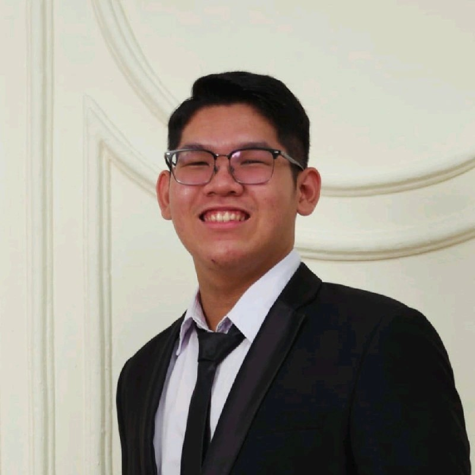

  

  

<h1 align="center">Halo! 👋 Saya Fransisco</h1>
<h3 align="center">Seorang Mahasiswa Computer Science di Universitas Bina Nusantara dengan minat Software Enggineering</h3>

  
  

---

### 👨‍💻 **Tentang Saya**

Halo! Saya adalah seorang mahasiswa **Ilmu Komputer (Computer Science)** di **Universitas Bina Nusantara** dengan antusiasme tinggi pada bidang **Software Engineering**. Saya bersemangat dalam merancang, membangun, dan mengoptimalkan perangkat lunak untuk menciptakan solusi yang efisien dan andal.

---

### 🛠️ **Toolbox & Keahlian Teknis**

Berikut adalah teknologi dan metodologi yang saya gunakan dalam pengembangan proyek:

* **Bahasa Pemrograman:**
    * `Java`
    * `C#`
    * `C++`
    * `C`
    * `HTML`
    * `CSS`
    * `SQL (Basic)`

* **Tools & Platform:**
    * **IDE:** Eclipse
    * **Version Control:** Git, GitHub
    * **Project Management:** Notion

* **Metodologi:**
    * Agile
    * Scrum

---

### 🌱 **Fokus Saat Ini**

Saat ini, saya sedang memperdalam pemahaman dan keahlian saya dalam:

* **Mobile Application Development**: Membangun aplikasi untuk platform mobile.
* **Object-Oriented Analysis & Design (OOAD)**: Menerapkan prinsip-prinsip desain untuk membangun arsitektur software yang *scalable* dan *maintainable*.
* **Framework Layer Architecture**: Memahami arsitektur berlapis dalam pengembangan aplikasi modern.

---

### 📚 **Pengetahuan Fundamental**

Fondasi akademis saya mencakup pemahaman yang kuat dalam konsep-konsep inti berikut:

* **Struktur Data & Algoritma**
* **Object-Oriented Programming (OOP)**
* **Software Design Patterns**
* **Database Technology**
* **Computer Networks**
* **Code Re-engineering & Optimization**

 

<strong>📠Klik untuk melihat daftar Mata Kuliah relevan yang telah saya pelajari</strong>

 

📚 **Semester 1**
  <ul>
    <li><b>Algorithm and Programming</b></li>
    <li><b>Basic Statistics</b></li>
    <li><b>Discrete Mathematics</b></li>
    <li><b>Linear Algebra</b></li>
    <li><b>Program Design Methods</b></li>
  </ul>

📚 **Semester 2**
  <ul>
    <li><b>Data Structures</b></li>
    <li><b>Human and Computer Interaction</b></li>
    <li><b>Scientific Computing</b></li>
    <li><b>Calculus</b></li>
  </ul>

📚 **Semester 3**
  <ul>
    <li><b>Algorithm Design and Analysis</b></li>
    <li><b>Artificial Intelligence</b></li>
    <li><b>Database Technology</b></li>
    <li><b>Object Oriented Programming</b></li>
    <li><b>Computer Networks</b></li>
    <li><b>Computational Physics</b></li>
  </ul>

⚙️ **Semester 4 - Software Engineering**
  <ul>
    <li><b>Software Engineering</b></li>
    <li><b>Software Design Patterns</b></li>
    <li><b>Agile Software Development</b></li>
    <li><b>Code Re-engineering</b></li>
    <li><b>Computational Biology</b></li>
  </ul>

⚙️ **Semester 5 - Software Engineering**
  <ul>
    <li><b>Framework Layer Architecture</b></li>
    <li><b>Object Oriented Analysis & Design</b></li>
    <li><b>Compilation Techniques</b></li>
    <li><b>Mobile Programming</b></li>
    <li><b>Operating System</b></li>
  </ul>

---

### 🛠️ Teknologi & Tools yang Saya Kuasai

  <b>Bahasa Pemrograman:</b> 
  
  
  
  
  
  
   

  <b>Frontend Development:</b> 
  
  
  
  
   

  <b>Database:</b> 
  
   
  
  <b>Tools & Platform:</b> 
  
  
  
  
  
   
  
  <b>Design:</b> 
  
  
   
  
  <b>Metodologi:</b> 
  
  

---
### 🚀 Proyek Campus

<table width="100%">
  <tr>
    <td width="50%">
      <h3><a href="https://bit.ly/4l5uwp6">Promigo</a></h3>
      

        Promigo adalah aplikasi promo berbasis web yang membantu mahasiswa BINUS Anggrek menemukan penawaran relevan, hemat, dan sesuai kebutuhan sehari-hari. Dibangun untuk meningkatkan daya jual brand lokal serta memudahkan akses informasi promo.
      

      

        <strong>Tech Stack:</strong> ReactJS, Supabase, Laravel
      

      

        | <a href="https://bit.ly/3FZMhHz">Github</a> | <a href="https://bit.ly/4l5uwp6">Notion</a> |
      

    </td>
    <td width="50%">
      
    </td>
  </tr>
</table>

<table width="100%">
  <tr>
    <td width="50%">
       
    </td>
    <td width="50%">
      <h3><a href="https://github.com/username-anda/nama-proyek-2">JAwels&Diamonds</a></h3>
      
<strong>JAwels&Diamonds</strong> adalah sistem manajemen item yang mendukung fitur penambahan, penghapusan, dan checkout. Proyek ini dibangun dengan menerapkan <strong>Strategy Pattern</strong> untuk menghasilkan arsitektur yang fleksibel, terstruktur, dan mudah dikembangkan.

      

        <strong>Tech Stack:</strong> Laravel, MySQL, Bootstrap.
      

    </td>
  </tr>
</table>

  
<strong>📄 Jelajahi Proyek Selengkapnya</strong>

  
   
  <table width="100%">
    <tr>
      <td width="50%">
        
      </td>
      <td width="50%">
        <h3><a href="https://drive.google.com/drive/folders/1lXHBlc7O2RNH4PZBO6qLio90aBSur4Cg?usp=drive_link">Automatic Licences Number plate Recognition System Project</a></h3>
        

          Sebuah proyek membuat prototype dari sebuah AI untuk mengenali nomor plate pada sebuah kendaraan.
        

        

          <strong>Tech Stack:</strong> Python
        

        

        | <a href="https://drive.google.com/drive/folders/1d2sterNA-lNCEtgtO-kiX3nu87JwgI4A?usp=drive_link">Code</a> | <a href="https://drive.google.com/drive/folders/1lXHBlc7O2RNH4PZBO6qLio90aBSur4Cg?usp=drive_link">Documetation</a> |
      

      </td>
    </tr>
  </table>

  <table width="100%">
    <tr>
      <td width="50%">
        <h3><a href="https://www.figma.com/proto/eDqUFcYOg39vRn5vtabPbP/Figma-HCI?node-id=1-3&p=f&t=qRGJ9P7BjC0fLwiF-1&scaling=min-zoom&content-scaling=fixed&page-id=0%3A1&starting-point-node-id=1%3A3">Project UI/UX Pariwisata Indonesia</a></h3>
        

         Merancang antarmuka dan pengalaman pengguna untuk website yang menyoroti keberagaman Indonesia, termasuk acara, budaya, keunikan, dan kuliner.
        

        

          <strong>Tech Stack:</strong> Figma
        

        

        | <a href="https://www.figma.com/proto/eDqUFcYOg39vRn5vtabPbP/Figma-HCI?node-id=1-3&p=f&t=qRGJ9P7BjC0fLwiF-1&scaling=min-zoom&content-scaling=fixed&page-id=0%3A1&starting-point-node-id=1%3A3">Lec Figma</a> | <a href="https://drive.google.com/file/d/1tCvhCuushn8aUPfjmDdXk0x43Afh694W/view?usp=sharing">Lec PPT</a> | 
      

      </td>
      <td width="50%">
        
      </td>
    </tr>
  </table>

  <table width="100%">
    <tr>
      <td width="50%">
        
      </td>
      <td width="50%">
        <h3><a href="https://www.figma.com/proto/lr3KauIxPFvJmG0qExRmwn/Untitled?node-id=3-4&starting-point-node-id=3%3A4">Project UI/UX DiamondCuts Motors</a></h3>
        

          Diamondcut adalah proyek tugas akhir berupa pengembangan website frontend untuk menampilkan informasi perusahaan, showroom, serta daftar mobil.
        

        

          <strong>Tech Stack:</strong> Figma, HTML, CSS, Javascript
        

      </td>
    </tr>
  </table>

  

---
<!--
### 📊 Statistik GitHub Saya

  
  

---
-->

### 📫 Hubungi Saya

Hubungi saya melalui LinkedIn atau email untuk berdiskusi lebih lanjut.
<  

